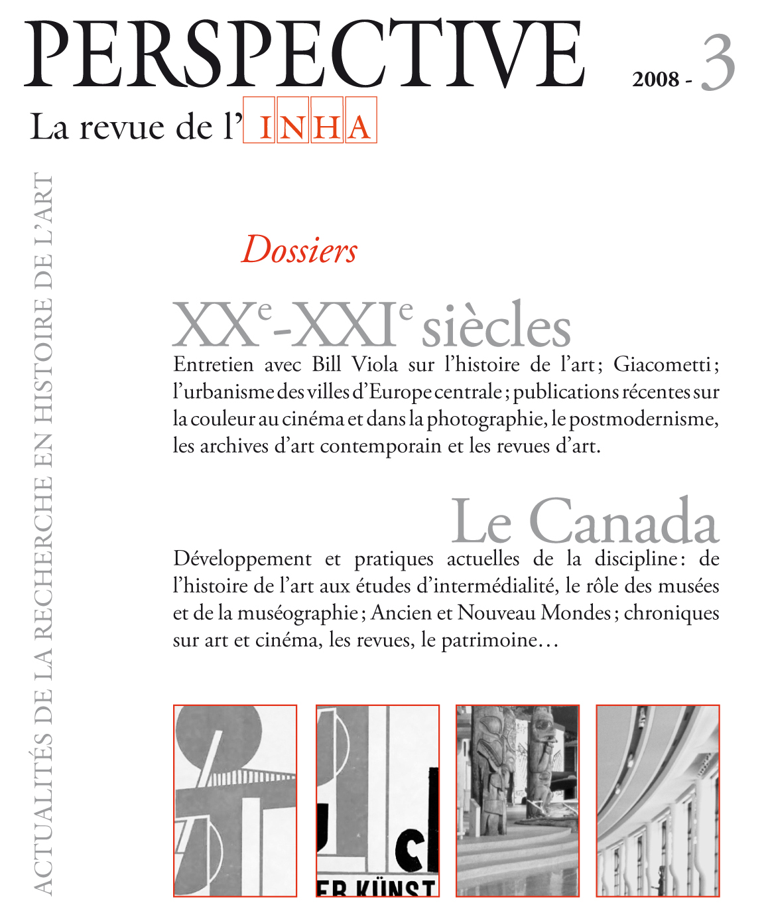

<!-- pandoc ./main.md -f markdown -t html --template=./dia.html -o ./main.html -->

# Que disent de la discipline une centaine de thèses en histoire de l’art au Québec ? une lecture distante

<section data-diapositive="seulement" data-state="centered">
# Que disent de la discipline une centaine de thèses en histoire de l’art au Québec ? une lecture distante
</section>

Par la nouveauté des sujets qu’elles abordent, les thèses de doctorat sont le premier lieu d’observation des inflexions d’une discipline. L’identification des travaux récents donne donc souvent lieu à des publications dans les revues savantes et fait parfois l’objet d’analyse approfondie. En raison de leur dépôt systématique depuis le milieu des années 2000, le corpus des travaux universitaires conservé dans des archives ouvertes institutionnelles constitue une source de premier plan pour documenter la pratique de l’histoire de l’art au Québec. Avec cette communication, nous proposons une lecture distante de ce corpus qui mobilise les métadonnées, l’analyse lexicale du texte des travaux et la reconnaissance automatique d’entités nommées pour mieux cerner la structuration de notre champ d’études dans le contexte du Doctorat interuniversitaire d’histoire de l’art, depuis le début des années 2000. Ces résultats descriptifs et quantitatifs seront discutés au regard des inflexions historiographiques de ces dernières années et comparés à l’échelle canadienne.

Je voudrais présenter un travail en cours pour mettre en place une liste dynamique et interactive des travaux en histoire de l’art conduits au sein du docInter. Un travail en cours, un peu par la force des choses, car j’ai malheureusement passé 8 jours alités avec un mauvaise grippe.

Objectifs

- établir une liste complète et actualisable des thèses soutenues dans le cadre du programme doctoral
- pouvoir faire des comparaisons à l’international
- valoriser les travaux réalisés à Montréal et plus généralement au Canada

Aspects historiographiques.

Travail précédent pancanadien.

## Quelques exemples inspirants

<section data-diapositive="">
{.figure  width="40%" height="40%"}
</section>

- Davis, Peggy, Michael Pantazzi, Todd Porterfield, Richard Taws, et Anne Lafont. 2008. « Les études canadiennes sur l’art en Europe autour de 1800 ». Perspective. Actualité en histoire de l’art, nᵒ 3 (septembre), 527‑34. https://doi.org/10.4000/perspective.3299.
- Gagnon, François-Marc, Janet Brooke, Jean-Philippe Uzel, Claudette Hould, Monia Abdallah, Stéphane Roy, et Katherine Sirois. 2008. « L’histoire de l’art au Canada : pratiques actuelles d’une discipline universitaire ». Perspective. Actualité en histoire de l’art, nᵒ 3 (septembre), 501‑12. https://doi.org/10.4000/perspective.3289.
- Lacroix, Laurier. 2008. « L’histoire de l’art au Canada : développement d’une pratique ». Perspective. Actualité en histoire de l’art, nᵒ 3 (septembre), 476‑500. https://doi.org/10.4000/perspective.3287.

Listes des travaux de recherche en histoire de l’art (INHA / APAHAU)

Travail US

## Constitution du corpus

Liste de 120 thèses présentée sur le site https://docinterhar.ca/fr/thesis-archive/

<section data-diapositive="seulement" data-background-iframe="https://docinterhar.ca/fr/thesis-archive/">
</section>

<section data-diapositive="seulement" data-background-iframe="https://www.collegeart.org/news/category/dissertations/">
</section>

### Sources de données

Le protocole OAI-PMH

Les exports MARC du catalogue commun (Worldcat). Pas d’accès à l’API.

Listes des thèses sur EBSCO

--> pas de source de données exaustives :

- le dépôt des thèses dans des archives ouvertes a seulement débuté vers 2006
- les données ne sont pas toujours fournies dans des formats de métadonnées uniforme
- problème de repérage des diplômes

= production d’un fichier structuré listant les dépôts pour y faciliter l’accès

## Analyse diachronique

Description générale

Nb de thèses, évolution

Directeurs

## Premirèe exploration thématique

### Term Frequency - Inverse Document Frequency (tf-idf)

méthode de traitement automatique des langues et de recherche d’informations

méthode d’exploration de corpus et d’une étape de prétraitement utile pour plusieurs autres méthodes de fouille de textes et de modélisation

« term specificity » (spécificité terminologique), dans un article de Karen Spärck Jones publié en 1972

>Plutôt que de représenter un terme par la fréquence brute de ses apparitions dans un document (c’est-à-dire son nombre d’occurrences) ou par sa fréquence relative (soit son nombre d’occurrences divisé par la longueur du document), l’importance de chaque terme est pondérée en divisant son nombre d’occurrences par le nombre de documents qui contiennent le mot dans le corpus. Cette pondération a pour effet d’éviter un problème fréquent en analyse textuelle : les mots les plus courants dans un document sont souvent les mots les plus courants dans tous les documents.

https://programminghistorian.org/fr/lecons/analyse-de-documents-avec-tfidf

## Perspective

Pb de consistance des données.

- Fournir un accès automatisé basé sur OAI-PMH
- Proposer une analyse thématique pancanadienne / internationale
- Caractériser la recherche en cours au Qc

Collaboration possible avec UAAC

Quels accès ?

Comment rendre compte de la diachronie

